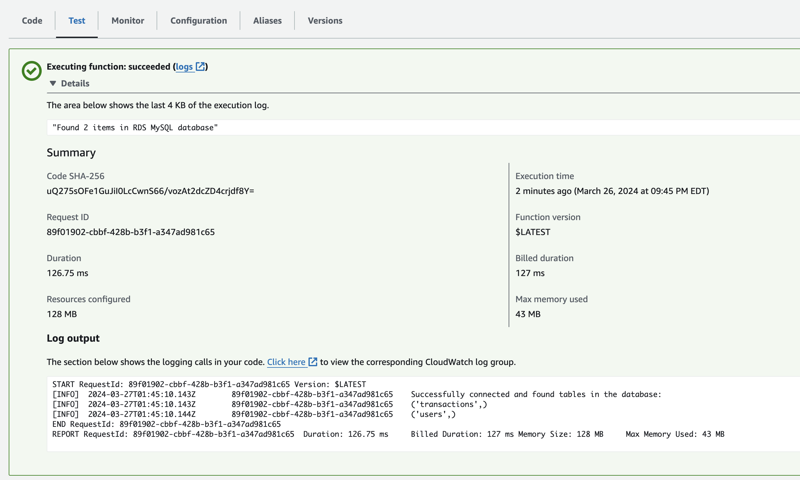
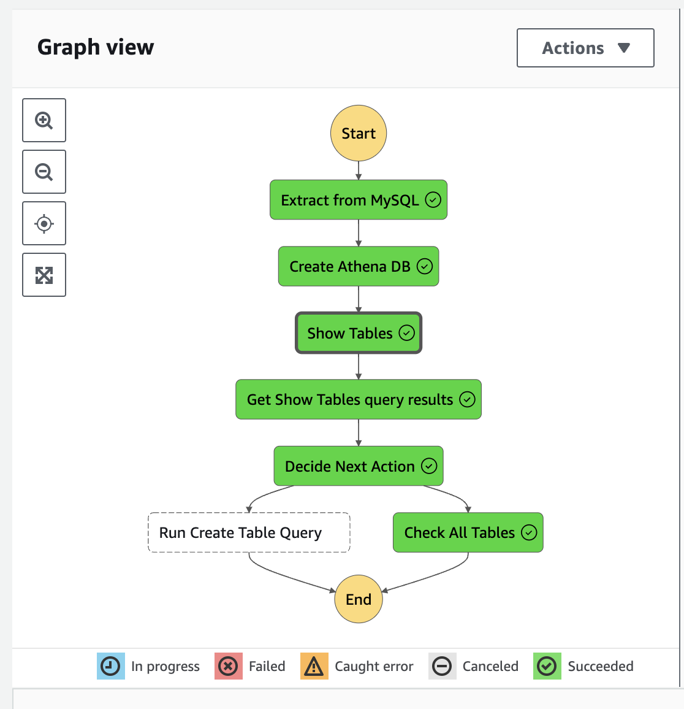
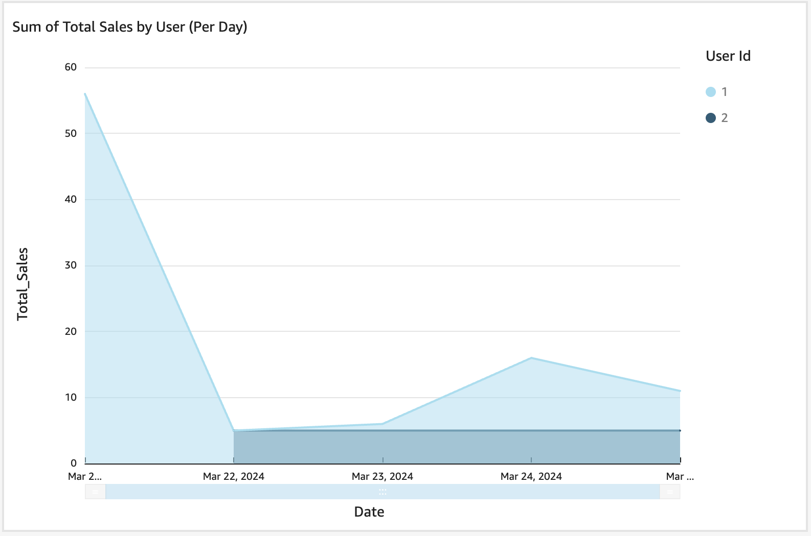
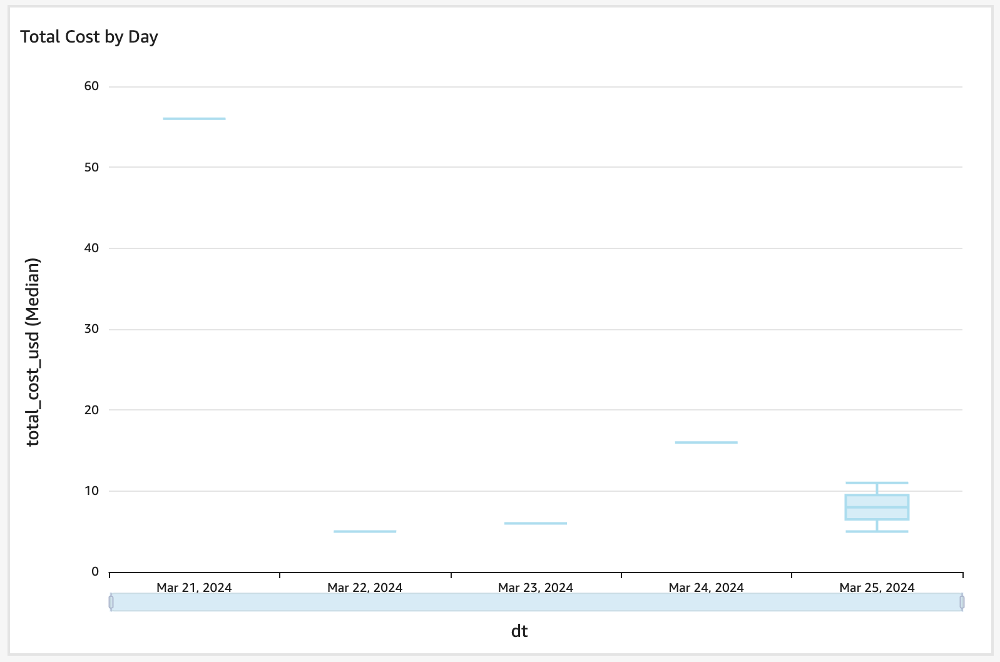

# Building a Serverless Data Pipeline with AWS for Batch ETL Processing

## Project Overview
This project demonstrates the creation of a data pipeline using AWS services, including CloudFormation, Aurora MySQL, Step Functions, Lambda, S3, Athena, and QuickSight. The primary goal was to learn the fundamentals of setting up and managing a data pipeline on AWS.

## Milestone 1: Provision Resources using CloudFormation
- Provisioned an S3 data lake bucket, Aurora MySQL instance, and a Step Function using CloudFormation.
- Focused on deploying these resources as a stack to understand IaC and AWS resource management.

## Milestone 2: Create a Pipeline to ETL Data from MySQL to S3
- Created a batch processing pipeline with a Step Function orchestrating a Lambda function.
- Exported data from MySQL to S3, demonstrating the ETL process.

## Milestone 3: Define Athena Tables and Visualize Data with QuickSight
- Defined Athena tables for the S3 data schema.
- Connected Athena tables to QuickSight for data visualization.

## Key Learnings
- The importance of detailed architecture and permissions management.
- Practical experience with various AWS services and IaC.

## Future Goals
- Develop expertise in pipeline design and event-driven architectures.
- Enhance understanding of IAM roles and permissions for smoother deployments.
